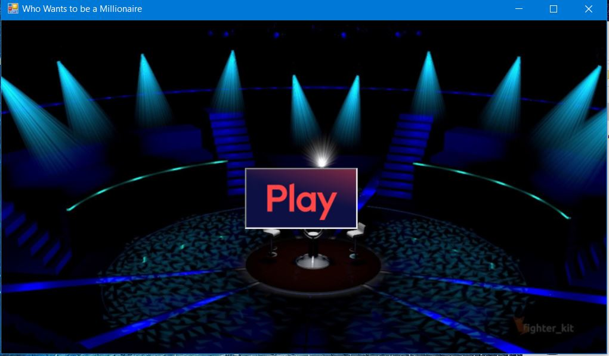
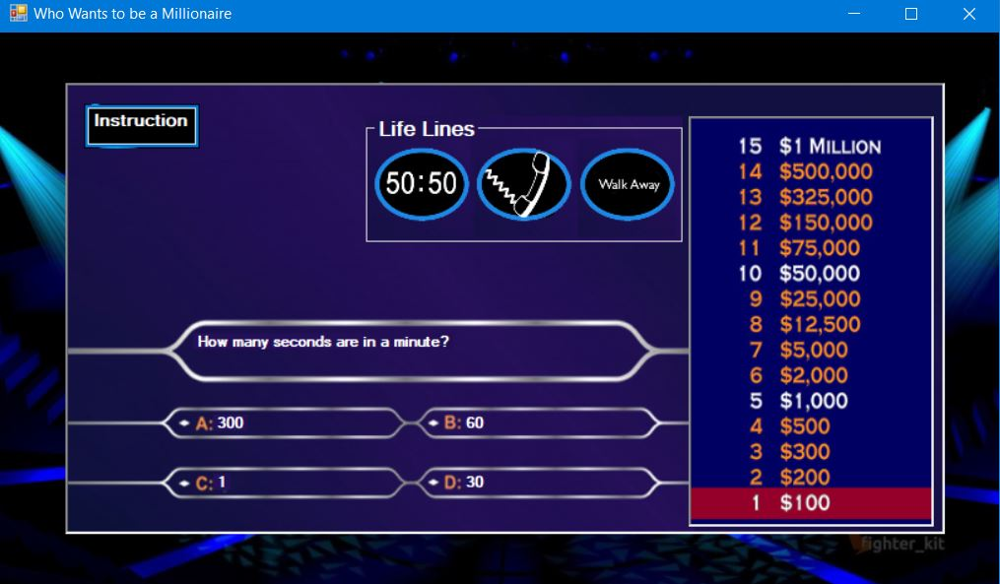
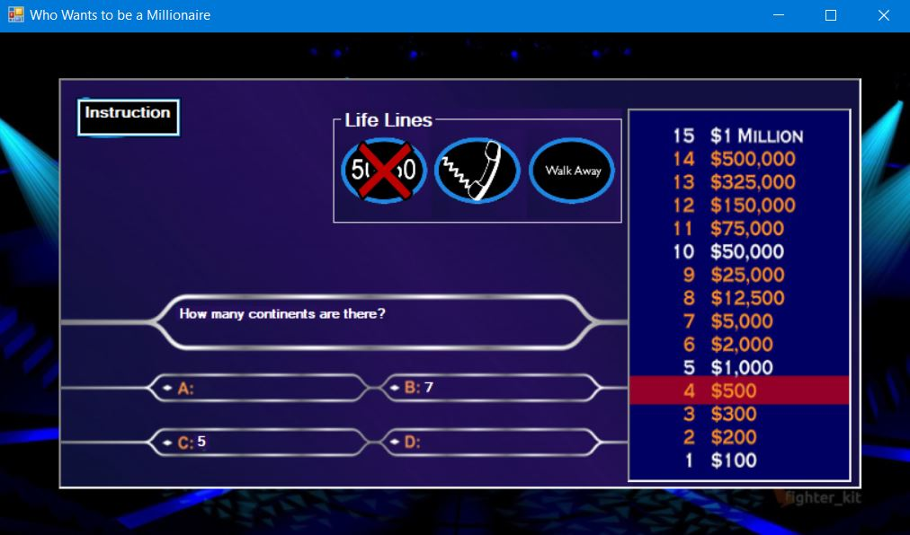
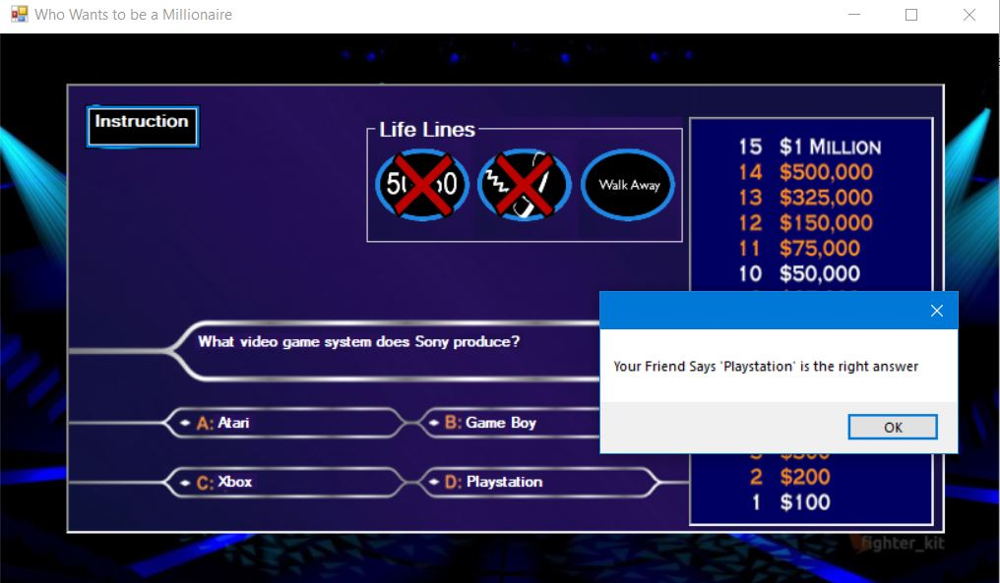
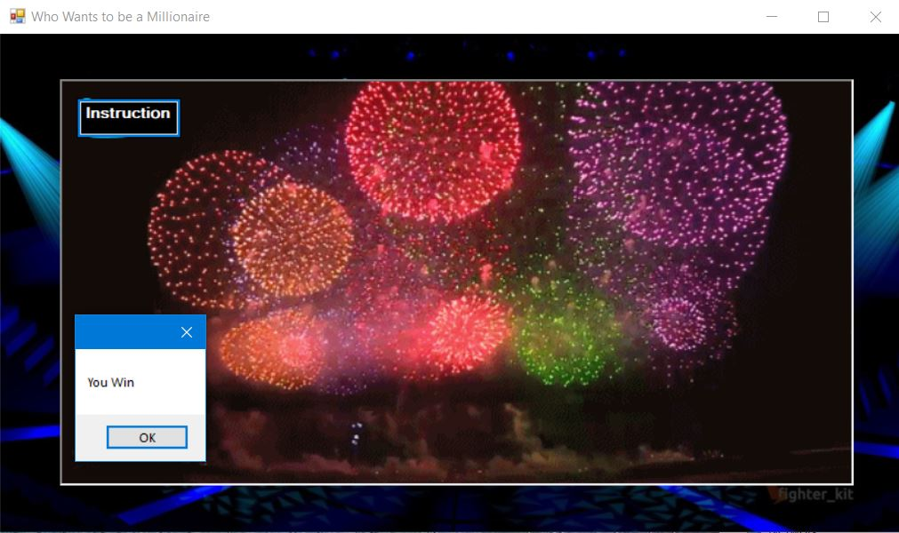

# Millionaire Game
 
PURPOSE: To develop a windows application that implements an interactive game; to 
use a variety of GUI components; to use a message box; to write a program using 
more than one class; to use arrays and array methods; to use the Random class; to 
use a do-while loop; and to use the ? operator.   

PROBLEM: ”Who Wants to be a Millionaire” Game
The Game: This game allows a contestant to discover answers to a series of 
questions. (Put a time limit on it for extra credit.) Contestants in your game will 
only have one life-line, that is the 50:50. Of course contestants can walk away 
with their earnings at any time in the game. If they miss a question, they lose 
what they have earned down to $100, $1000, $32,000.
 
 

